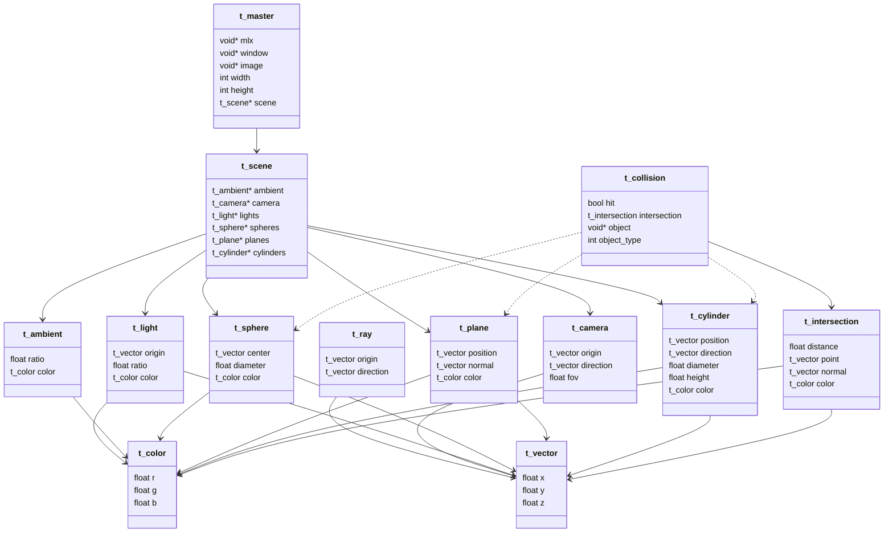

# MiniRT Struct Relationships

```mermaid
classDiagram
    class t_color {
        float r
        float g
        float b
    }

    class t_vector {
        float x
        float y
        float z
    }

    class t_ray {
        t_vector origin
        t_vector direction
    }

    class t_intersection {
        float distance
        t_vector point
        t_vector normal
        t_color color
    }

    class t_collision {
        bool hit
        t_intersection intersection
        void* object
        int object_type
    }

    class t_camera {
        t_vector origin
        t_vector direction
        float fov
    }

    class t_ambient {
        float ratio
        t_color color
    }

    class t_light {
        t_vector origin
        float ratio
        t_color color
    }

    class t_sphere {
        t_vector center
        float diameter
        t_color color
    }

    class t_plane {
        t_vector position
        t_vector normal
        t_color color
    }

    class t_cylinder {
        t_vector position
        t_vector direction
        float diameter
        float height
        t_color color
    }

    class t_scene {
        t_ambient* ambient
        t_camera* camera
        t_light* lights
        t_sphere* spheres
        t_plane* planes
        t_cylinder* cylinders
    }

    class t_master {
        void* mlx
        void* window
        void* image
        int width
        int height
        t_scene* scene
    }

    t_ray --> t_vector
    t_camera --> t_vector
    t_light --> t_vector
    t_light --> t_color
    t_ambient --> t_color
    t_sphere --> t_vector
    t_sphere --> t_color
    t_plane --> t_vector
    t_plane --> t_color
    t_cylinder --> t_vector
    t_cylinder --> t_color
    t_scene --> t_ambient
    t_scene --> t_camera
    t_scene --> t_light
    t_scene --> t_sphere
    t_scene --> t_plane
    t_scene --> t_cylinder
    t_intersection --> t_vector
    t_intersection --> t_color
    t_collision --> t_intersection
    t_collision ..> t_sphere
    t_collision ..> t_plane
    t_collision ..> t_cylinder
    t_master --> t_scene
```
